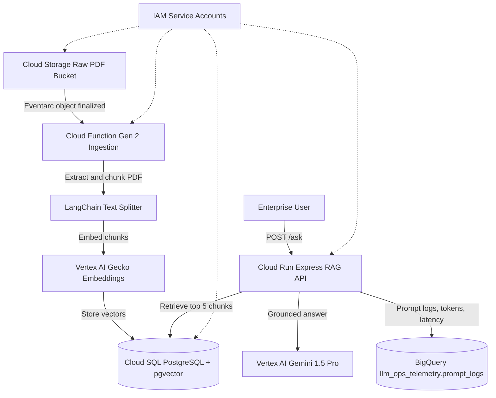

# Vertex Enterprise RAG

Enterprise Deployment Blueprint for GenAI on Google Cloud.

This repository demonstrates a secure Retrieval-Augmented Generation landing zone for enterprise compliance and RFP intelligence. It separates document ingestion from inference, keeps enterprise data in a customer-controlled Google Cloud project, and captures LLMOps telemetry for governance and adoption reporting.

## Architecture



## Security and Governance

- Terraform provisions separate service accounts for ingestion and app runtimes.
- Cloud SQL uses private IP through Private Service Access.
- Cloud Run and Cloud Functions reach private resources through Serverless VPC Access.
- GCS enforces uniform bucket-level access and public access prevention.
- Database credentials are generated by Terraform and stored in Secret Manager.
- The app relies on Cloud Run IAM and Google Cloud perimeter controls instead of an application-level API key.
- Customer documents, embeddings, prompts, responses, and telemetry stay inside project `vertex-enterprise-rag` in region `us-central1`, except for managed Google Cloud control-plane operations.

## Prerequisites

- Google Cloud project: `vertex-enterprise-rag`
- Billing enabled
- `gcloud` authenticated with permissions to create IAM, networking, Cloud SQL, Cloud Run, Cloud Functions, BigQuery, Secret Manager, Artifact Registry, and GCS resources
- Terraform 1.6+
- Node.js 20+
- Python 3.11+
- Docker

## Deploy Infrastructure

```bash
gcloud config set project vertex-enterprise-rag
terraform -chdir=terraform init
terraform -chdir=terraform apply
```

Capture outputs:

```bash
RAW_BUCKET="$(terraform -chdir=terraform output -raw raw_bucket_name)"
INGESTION_SA="$(terraform -chdir=terraform output -raw ingestion_service_account_email)"
APP_SA="$(terraform -chdir=terraform output -raw app_service_account_email)"
DB_HOST="$(terraform -chdir=terraform output -raw cloud_sql_private_ip)"
DB_NAME="$(terraform -chdir=terraform output -raw database_name)"
DB_USER="$(terraform -chdir=terraform output -raw database_user)"
DB_SECRET="$(terraform -chdir=terraform output -raw db_password_secret_id)"
VPC_CONNECTOR="$(terraform -chdir=terraform output -raw vpc_connector_id)"
```

## Deploy Ingestion Function

```bash
gcloud functions deploy vertex-rag-ingestion \
  --gen2 \
  --runtime=python311 \
  --region=us-central1 \
  --source=functions/ingestion \
  --entry-point=ingest_pdf \
  --trigger-bucket="${RAW_BUCKET}" \
  --service-account="${INGESTION_SA}" \
  --vpc-connector="${VPC_CONNECTOR}" \
  --egress-settings=private-ranges-only \
  --set-env-vars="GCP_PROJECT_ID=vertex-enterprise-rag,GCP_REGION=us-central1,DB_HOST=${DB_HOST},DB_PORT=5432,DB_NAME=${DB_NAME},DB_USER=${DB_USER},PGVECTOR_COLLECTION=enterprise_documents" \
  --set-secrets="DB_PASSWORD=${DB_SECRET}:latest"
```

## Build and Deploy Cloud Run App

```bash
REGION="us-central1"
PROJECT_ID="vertex-enterprise-rag"
IMAGE="${REGION}-docker.pkg.dev/${PROJECT_ID}/vertex-rag-app/vertex-enterprise-rag-app:latest"

gcloud builds submit app --tag "${IMAGE}"

gcloud run deploy vertex-rag-app \
  --image="${IMAGE}" \
  --region="${REGION}" \
  --service-account="${APP_SA}" \
  --vpc-connector="${VPC_CONNECTOR}" \
  --egress-settings=private-ranges-only \
  --no-allow-unauthenticated \
  --set-env-vars="GCP_PROJECT_ID=${PROJECT_ID},GCP_REGION=${REGION},DB_HOST=${DB_HOST},DB_PORT=5432,DB_NAME=${DB_NAME},DB_USER=${DB_USER},BQ_DATASET=llm_ops_telemetry,BQ_TABLE=prompt_logs,PGVECTOR_COLLECTION=enterprise_documents" \
  --set-secrets="DB_PASSWORD=${DB_SECRET}:latest"
```

## Upload a PDF

```bash
gcloud storage cp ./sample.pdf "gs://${RAW_BUCKET}/sample.pdf"
```

## Query the API

```bash
SERVICE_URL="$(gcloud run services describe vertex-rag-app --region=us-central1 --format='value(status.url)')"
TOKEN="$(gcloud auth print-identity-token)"

curl -X POST "${SERVICE_URL}/ask" \
  -H "Authorization: ******" \
  -H "Content-Type: application/json" \
  -d '{"query":"What controls are described in the uploaded documents?","user_id":"demo-user"}'
```

## Validate Telemetry

```bash
bq query --use_legacy_sql=false \
  'SELECT timestamp, user_id, prompt_tokens, completion_tokens, latency_ms, status
   FROM `vertex-enterprise-rag.llm_ops_telemetry.prompt_logs`
   ORDER BY timestamp DESC
   LIMIT 10'
```
