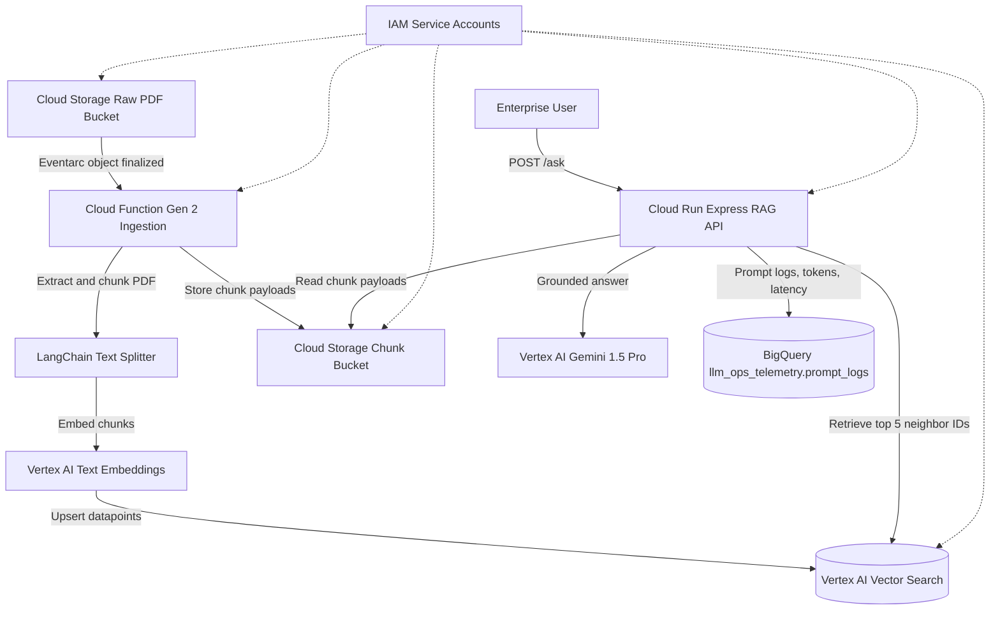

# Vertex Enterprise RAG

Enterprise Deployment Blueprint for GenAI on Google Cloud.

This repository demonstrates a secure Retrieval-Augmented Generation landing zone for enterprise compliance and RFP intelligence. It separates document ingestion from inference, keeps enterprise data in a customer-controlled Google Cloud project, and captures LLMOps telemetry for governance and adoption reporting.

## Tech Stack

| Layer | Resource or Tool | Role | Purpose | Used by |
| --- | --- | --- | --- | --- |
| Infrastructure | Terraform + Google Cloud provider | Deployment orchestrator | Provisions the complete landing zone repeatably: IAM, storage, Vertex AI Vector Search, telemetry, and serverless runtimes. | Platform engineers and customer engineering teams. |
| Compute | Cloud Run | Agent API runtime | Hosts the TypeScript Express/LangChain RAG API that receives `POST /ask` requests and returns grounded answers with sources. | Enterprise users through an internal client, load balancer, or IAP-protected entry point. |
| Compute | Cloud Functions Gen 2 | Document ingestion runtime | Runs the Python PDF parser when new raw PDFs land in Cloud Storage. | Eventarc invokes it; the ingestion service account executes it. |
| Events | Eventarc | Storage event router | Converts Cloud Storage object-finalized events into ingestion function invocations. | Cloud Storage publishes events; Cloud Functions receives them. |
| AI/ML | Vertex AI Gemini 1.5 Pro | Reasoning and answer generation model | Generates enterprise-context-grounded responses from retrieved chunks. | Cloud Run app through the app service account. |
| AI/ML | Vertex AI Text Embeddings (`text-embedding-005`) | Embedding model | Converts document chunks and user queries into vectors for similarity search. | Cloud Function during ingestion and Cloud Run during retrieval. |
| Vector Store | Vertex AI Vector Search | Implemented managed vector index | Stores document chunk embeddings for low-latency nearest-neighbor retrieval without operating a database. | Cloud Function upserts datapoints; Cloud Run retrieves the top 5 neighbor IDs. |
| Storage | Cloud Storage | Raw document and chunk storage | Stores uploaded enterprise PDFs plus JSON chunk payloads keyed by Vector Search datapoint ID. | Enterprise users or systems upload PDFs; Cloud Function reads PDFs and writes chunks; Cloud Run reads retrieved chunks. |
| Telemetry | BigQuery | LLMOps and governance store | Stores prompt, response, token, latency, user, and status telemetry in `llm_ops_telemetry.prompt_logs`. | Cloud Run writes rows; business, governance, and platform stakeholders query metrics. |
| Security | IAM service accounts and roles | Least-privilege identity boundary | Separates ingestion permissions from runtime app permissions and limits access to only required APIs. | Terraform creates bindings; Google Cloud enforces access at runtime. |
| Container Supply Chain | Artifact Registry | Container image registry | Stores the built Cloud Run app image. | Cloud Build pushes images; Cloud Run pulls them. |
| Build | Cloud Build | Container builder | Builds the production Node.js image from `app/Dockerfile`. | Developers run `gcloud builds submit`; Cloud Run deploys the produced image. |

## Architecture



## Security and Governance

- Terraform provisions separate service accounts for ingestion and app runtimes.
- Cloud Storage enforces uniform bucket-level access and public access prevention for raw PDFs and retrieved chunk payloads.
- Vertex AI Vector Search keeps embeddings in a managed Google Cloud index rather than a self-managed vector database.
- The app relies on Cloud Run IAM and Google Cloud perimeter controls instead of an application-level API key.
- Customer documents, embeddings, prompts, responses, and telemetry stay inside project `vertex-enterprise-rag` in region `us-central1`, except for managed Google Cloud control-plane operations.

## Prerequisites

- Google Cloud project: `vertex-enterprise-rag`
- Billing enabled
- `gcloud` authenticated with permissions to create IAM, Vertex AI, Cloud Run, Cloud Functions, BigQuery, Artifact Registry, and GCS resources
- Terraform Google provider credentials configured with Application Default Credentials:
  `gcloud auth application-default login`
- Terraform 1.6+
- Node.js 20+
- Python 3.11+
- Docker

## How to Use

1. Deploy the Google Cloud landing zone with Terraform.
2. Deploy the ingestion Cloud Function and upload a PDF to the raw bucket.
3. Build and deploy the Cloud Run RAG API image.
4. Query `POST /ask` from an internal Google Cloud client or through a load balancer/IAP path.
5. Review prompt, response, token, latency, and status telemetry in BigQuery.

The detailed copy-paste commands below follow that order. Terraform deploys the streaming Vector Search index and endpoint before the ingestion function upserts document vectors.

## Step-by-Step Execution Plan

1. **Infrastructure Code:** Use Terraform to provision Cloud Storage, BigQuery, Vertex AI Vector Search, Cloud Run, Cloud Functions support, and IAM service accounts. This is the core customer-engineering proof point because the deployment is auditable and repeatable.
2. **Ingestion Pipeline:** Upload PDFs to Cloud Storage, trigger the Python Cloud Function with Eventarc, chunk documents with LangChain, generate Vertex AI embeddings, write chunk payloads to Cloud Storage, and upsert vectors to Vertex AI Vector Search.
3. **Agent App:** Deploy the TypeScript Express/LangChain API to Cloud Run, connect it to Vertex AI instead of OpenAI, retrieve enterprise context, and answer from Gemini 1.5 Pro.
4. **LLMOps Integration:** Log each RAG request to BigQuery with `user_id`, prompt, response, token counts, latency, and status for adoption and ROI reporting.
5. **README Pitch:** Present the repo as a golden-path blueprint for customers blocked by infosec concerns: fast time-to-value, Terraform-driven deployment orchestration, least-privilege IAM, and data sovereignty inside the customer Google Cloud project.

## Deploy Infrastructure

```bash
gcloud config set project vertex-enterprise-rag
terraform -chdir=terraform init
terraform -chdir=terraform apply
```

Capture outputs:

```bash
RAW_BUCKET="$(terraform -chdir=terraform output -raw raw_bucket_name)"
INGESTION_SA="$(terraform -chdir=terraform output -raw ingestion_service_account_email)"
APP_SA="$(terraform -chdir=terraform output -raw app_service_account_email)"
VECTOR_CHUNKS_BUCKET="$(terraform -chdir=terraform output -raw vector_chunks_bucket_name)"
VECTOR_SEARCH_INDEX="$(terraform -chdir=terraform output -raw vector_search_index_name)"
VECTOR_SEARCH_INDEX_ENDPOINT="$(terraform -chdir=terraform output -raw vector_search_index_endpoint_name)"
VECTOR_SEARCH_DEPLOYED_INDEX_ID="$(terraform -chdir=terraform output -raw vector_search_deployed_index_id)"
```

## Deploy Ingestion Function

The ingestion function writes each chunk payload to Cloud Storage and upserts its embedding to the Terraform-managed Vertex AI Vector Search index.

```bash
gcloud functions deploy vertex-rag-ingestion \
  --gen2 \
  --runtime=python311 \
  --memory=1Gi \
  --timeout=540s \
  --region=us-central1 \
  --source=functions/ingestion \
  --entry-point=ingest_pdf \
  --trigger-bucket="${RAW_BUCKET}" \
  --service-account="${INGESTION_SA}" \
  --clear-secrets \
  --clear-vpc-connector \
  --set-env-vars="GCP_PROJECT_ID=vertex-enterprise-rag,GCP_REGION=us-central1,VECTOR_SEARCH_INDEX_ID=${VECTOR_SEARCH_INDEX},VECTOR_CHUNKS_BUCKET=${VECTOR_CHUNKS_BUCKET}"
```

After deploying the function, upload a PDF to trigger ingestion. This repository includes `1706.03762v7.pdf` as one example, but you can bring your own PDF and upload it to the same raw bucket path.

```bash
RAW_BUCKET="$(terraform -chdir=terraform output -raw raw_bucket_name)"
gcloud storage cp ./1706.03762v7.pdf "gs://${RAW_BUCKET}/papers/1706.03762v7.pdf"
```

Wait for the ingestion function to complete (check Cloud Functions logs). The Cloud Run retriever queries Vector Search for neighbor IDs and then reads matching chunk payloads from the chunk bucket.

## Build and Deploy Cloud Run App

```bash
REGION="us-central1"
PROJECT_ID="vertex-enterprise-rag"
IMAGE="${REGION}-docker.pkg.dev/${PROJECT_ID}/vertex-rag-app/vertex-enterprise-rag-app:latest"

gcloud builds submit app --tag "${IMAGE}"

gcloud run deploy vertex-rag-app \
  --image="${IMAGE}" \
  --region="${REGION}" \
  --service-account="${APP_SA}" \
  --ingress=internal-and-cloud-load-balancing \
  --no-allow-unauthenticated \
  --clear-secrets \
  --clear-vpc-connector \
  --set-env-vars="GCP_PROJECT_ID=${PROJECT_ID},GCP_REGION=${REGION},BQ_DATASET=llm_ops_telemetry,BQ_TABLE=prompt_logs,VECTOR_SEARCH_INDEX_ENDPOINT_ID=${VECTOR_SEARCH_INDEX_ENDPOINT},VECTOR_SEARCH_DEPLOYED_INDEX_ID=${VECTOR_SEARCH_DEPLOYED_INDEX_ID},VECTOR_CHUNKS_BUCKET=${VECTOR_CHUNKS_BUCKET}"
```

## Upload a PDF

Get the raw PDF bucket name from Terraform before uploading:

```bash
RAW_BUCKET="$(terraform -chdir=terraform output -raw raw_bucket_name)"
gcloud storage cp ./1706.03762v7.pdf "gs://${RAW_BUCKET}/papers/1706.03762v7.pdf"
```

`1706.03762v7.pdf` is the `Attention Is All You Need` paper (arXiv:1706.03762), included as a sample document for testing. It is useful for RAG validation because it contains multi-column layouts, mathematical formulas, tables, and dense technical terminology. This is only one example; you can bring your own PDF and upload it with the same command pattern.

## Query the API

The Cloud Run service is deployed with internal-and-load-balancer ingress for the enterprise blueprint. Call it from an internal Google Cloud client or through an HTTPS load balancer/IAP in front of Cloud Run. Direct local calls to the default `run.app` URL may return 404 because external ingress is intentionally blocked.

```bash
SERVICE_URL="$(gcloud run services describe vertex-rag-app --region=us-central1 --format='value(status.url)')"
TOKEN="$(gcloud auth print-identity-token)"

curl -X POST "${SERVICE_URL}/ask" \
  -H "Authorization: ******" \
  -H "Content-Type: application/json" \
  -d '{"query":"What controls are described in the uploaded documents?","user_id":"demo-user"}'
```

## RAG Evaluation: Attention Is All You Need

Use the `Attention Is All You Need` paper as a concrete RAG test document. Upload the repository copy named `1706.03762v7.pdf` to the raw PDF bucket, wait for the ingestion function to finish, then run the queries below through `POST /ask`.

```bash
RAW_BUCKET="$(terraform -chdir=terraform output -raw raw_bucket_name)"
gcloud storage cp ./1706.03762v7.pdf "gs://${RAW_BUCKET}/papers/1706.03762v7.pdf"
```

| # | Query | Retrieval capability tested |
| --- | --- | --- |
| 1 | What specific hardware setup and optimizer were used to train the base and big Transformer models? Additionally, how long did the training take for each model, and what were their final BLEU scores on the WMT 2014 English-to-German dataset? | Factual extraction across hardware, optimizer, schedule, and results sections. |
| 2 | Explain the mathematical formulation of "Scaled Dot-Product Attention" as described in the paper. Why did the authors find it necessary to scale the dot products by the inverse square root of `d_k` compared to standard additive attention? | Formula retrieval plus conceptual reasoning about softmax gradients. |
| 3 | According to Section 4 and Table 1, how does a self-attention layer compare to recurrent and convolutional layers across the three desiderata evaluated by the authors: computational complexity per layer, minimum number of sequential operations, and maximum path length? | Table interpretation and comparative analysis. |
| 4 | Detail the architectural differences between the encoder and decoder stacks in the Transformer. Specifically, what additional sub-layer is introduced in the decoder, and how is the self-attention mechanism modified to preserve the auto-regressive property? | Structural understanding of encoder/decoder architecture and masking. |
| 5 | Since the Transformer dispenses with recurrence and convolutions, how does it inject information about the sequence order of the tokens? Describe the specific mathematical functions and dimensions used for this mechanism. | Specific design-choice retrieval for positional encoding equations and dimensions. |

Example request shape:

```bash
curl -X POST "${SERVICE_URL}/ask" \
  -H "Authorization: ******" \
  -H "Content-Type: application/json" \
  -d '{"query":"Explain the mathematical formulation of Scaled Dot-Product Attention as described in the paper.","user_id":"rag-eval"}'
```

## Validate Telemetry

```bash
bq query --use_legacy_sql=false \
  'SELECT timestamp, user_id, prompt_tokens, completion_tokens, latency_ms, status
   FROM `vertex-enterprise-rag.llm_ops_telemetry.prompt_logs`
   ORDER BY timestamp DESC
   LIMIT 10'
```

## How to Test

Run local validation before deployment:

```bash
terraform -chdir=terraform fmt -check
terraform -chdir=terraform init -backend=false -input=false
terraform -chdir=terraform validate

cd functions/ingestion
python3 -m venv venv
source venv/bin/activate
python -m pip install -r requirements.txt
python -m pytest test_utils.py -v

cd ../../app
npm ci
npm test
npm run build
```

Check deployed resource health after deployment:

```bash
gcloud functions describe vertex-rag-ingestion \
  --region=us-central1 \
  --format='value(state,serviceConfig.availableMemory,serviceConfig.timeoutSeconds)'

gcloud run services describe vertex-rag-app \
  --region=us-central1 \
  --format='value(status.latestReadyRevisionName,status.traffic[0].percent,status.url)'

bq show vertex-enterprise-rag:llm_ops_telemetry.prompt_logs

gcloud ai indexes describe "$(basename "$(terraform -chdir=terraform output -raw vector_search_index_name)")" \
  --region=us-central1 \
  --format='value(displayName,indexUpdateMethod)'

gcloud ai index-endpoints describe "$(basename "$(terraform -chdir=terraform output -raw vector_search_index_endpoint_name)")" \
  --region=us-central1 \
  --format='value(displayName,deployedIndexes[0].id)'
```

Direct local calls to the default Cloud Run URL may return 404 because ingress is intentionally limited to internal and load-balancer traffic. Test `/ask` from an allowed internal client or through the configured external HTTPS load balancer/IAP path.
