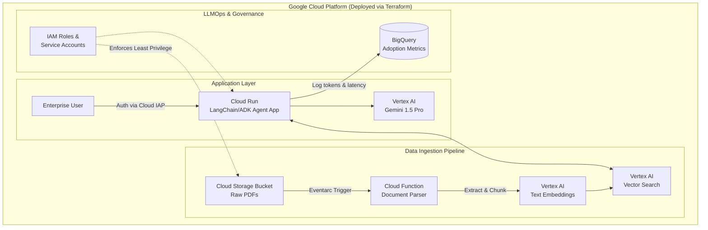

### Enterprise GenAI Secure Landing Zone on GCP

To prove you are ready to be a Google CE, your next project should shift focus from the _AI application itself_ to the **infrastructure, security, and scalable pipelines around the AI**.

I suggest building an **"Enterprise Compliance & RFP Intelligence Pipeline."**

#### The Concept

An end-to-end Terraform-deployed Google Cloud architecture where enterprise PDFs (like security compliance docs or RFPs) are uploaded to a GCS bucket, automatically embedded via Vertex AI, and queried securely by an internal facing Cloud Run app.

#### What this proves to the Hiring Manager:

_"I don't just write agent code. I know how to deploy Gemini securely inside a customer's VPC, automate the infrastructure with Terraform, and build a scalable data pipeline that respects Enterprise IAM policies."_

#### The Tech Stack to Use:

- **Infrastructure:** Terraform
- **Compute:** Google Cloud Run (Hosting the UI/Agent)
- **AI/ML:** Vertex AI Gemini 1.5 Pro, Vertex AI Text Embeddings, Vertex AI Vector Search
- **Storage/Data:** Google Cloud Storage (GCS) for raw PDFs, BigQuery for telemetry/LLMOps.
- **Security:** Google Cloud IAM (Service Accounts with least privilege).

---

### 🗺️ Architecture Blueprint for the Next Repo

Include a Mermaid diagram like this in your next `README.md`:

### 📋 The Step-by-Step Execution Plan

1. **The Infrastructure Code (Terraform):**
   Create a `terraform/` folder. Write scripts to provision a GCS Bucket, a BigQuery dataset (for logs), a Cloud Run service, and the necessary IAM Service Accounts. _This is the most critical part for a CE portfolio._
2. **The Ingestion Pipeline:**
   Write a Python/TypeScript Cloud Function that triggers when a PDF is dropped into the GCS bucket. It chunks the PDF using LangChain, calls the Vertex AI embedding model, and pushes the vectors to a database (can use pgvector on Cloud SQL or Vertex AI Vector Search).
3. **The Agent App (Cloud Run):**
   Take the agent logic from your _current_ repo, but connect it to Vertex AI instead of OpenAI. Wrap it in a simple Express.js API or Streamlit UI, and deploy it to Cloud Run.
4. **The LLMOps Integration:**
   After every LLM call, asynchronously write a JSON payload to BigQuery logging the `user_id`, `prompt_tokens`, `completion_tokens`, `latency_ms`, and `success_status`.
5. **The README.md (The Pitch):**
   Frame the README explicitly around **Time-to-Value**, **Deployment Orchestration**, and **Data Sovereignty**. Explain that this repo acts as a "Golden Path Blueprint" for customers who want to deploy GenAI but are blocked by infosec concerns.

### Why this gets you the job:

When you present this in an interview, you won't just be talking about prompts and agents. You will be talking about:

- _"I separated the ingestion pipeline from the inference layer for scalability."_
- _"I used Terraform so the customer's platform team can audit and replicate the deployment in 10 minutes."_
- _"I bound a strict Service Account to Cloud Run so the LLM cannot access any GCS buckets outside of its authorized scope, guaranteeing data sovereignty."_
- _"I stream usage metrics to BigQuery so the business stakeholders can track ROI and AI adoption rates across different departments."_

**That** is exactly what a Senior AI Adoption Customer Engineer at Google does every day. Keep your current repo (it proves you are a deep coder), and build this next one to prove you are an Enterprise Architect.
